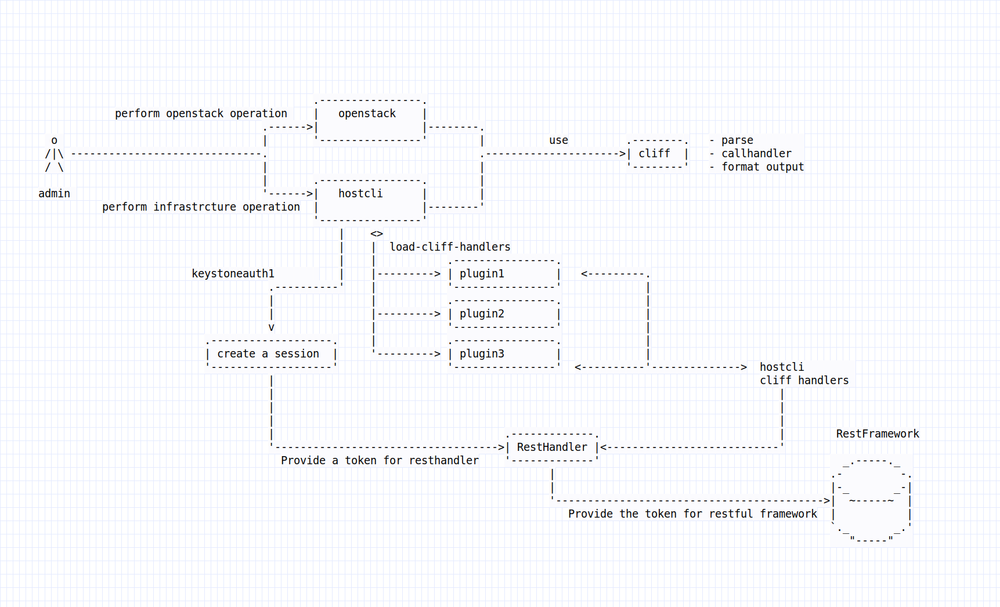

::

   Copyright 2019 Nokia

   Licensed under the Apache License, Version 2.0 (the "License");

   you may not use this file except in compliance with the License.
   You may obtain a copy of the License at

       http://www.apache.org/licenses/LICENSE-2.0

   Unless required by applicable law or agreed to in writing, software
   distributed under the License is distributed on an "AS IS" BASIS,
   WITHOUT WARRANTIES OR CONDITIONS OF ANY KIND, either express or implied.
   See the License for the specific language governing permissions and
   limitations under the License.

==============================
Host CLI
==============================

.. raw:: pdf

   PageBreak

.. sectnum::

.. contents::

.. raw:: pdf

   PageBreak

Introduction
============

Cloud infratructure is openstack based, openstack services already utilize 
a common framework for openstack own commands. These commands are accessed via 
the **openstack** command. The syntax used in this command is the following:

::

  openstack <openstack domain> <operation> [<options>]

Below is an example of some **openstack** commands.

::

  openstack server list

  openstack server show <server-name>

  openstack network list

  ...

The **openstack** command is implemented ontop of the python **cliff** framework.

**cliff** framework supports the following:

- structure the commands tokens.

- map command tokens to command handlers.

- parse command arguments.

- format commands output.

- bash auto-completion of commands.

A well integrated platform is expected to provide a common way to access the 
interfaces provided by the platform. As such cloud infrastructure utilizes 
the same **cliff** framework to implement the infrastrcture own middleware CLIs. 

The infrastrcutre CLIs can be accessed via the **hostcli** command. 

The syntax used in this command is the following:

::

 hostcli <middleware domain> <operation> [<options>]

Below is an example of some **hostcli** commands.

::

 hostcli has show nodes

 hostcli has show services --node <node-name>

 hostcli motd show

 hostcli motd set --motd <message of the day text>

 ...

In addition to providing the common look and feel for the end user, the 
*hostcli* takes care of authorizing with keystone and provide a token
for authentication usage

The following diagram describes the highlevel design for **hostcli** CLI 
frameowk.

When using yarf restful framework to implement the backend for middleware
the frame provides a RestRequest class to make the authentication transperant
to a module.

Example of using this request:

.. code:: python

    def take_action(self, parsed_args):
        req = self.app.client_manager.resthandler
        ret = req.get("has/v1/cluster", decode_json=True)
        status = ret['data']
        columns = ('admin-state',
                   'running-state',
                   'role'
                  )
        data = (status['admin-state'],
                status['running-state'],
                status['role']
                )
        return (columns, data)

The beef is ot get the resthandler from client_manager that is defined in the app.
This will return the object RestRequest for you that has the HTTP operations predefined.
The only thing needed is the path of the url. The actual address should not be defined, 
since it's extracted from the keystone session from the endpoints.
